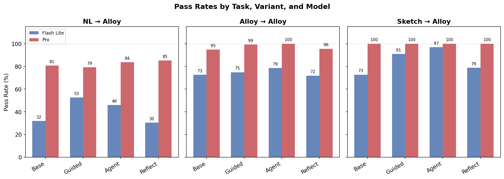
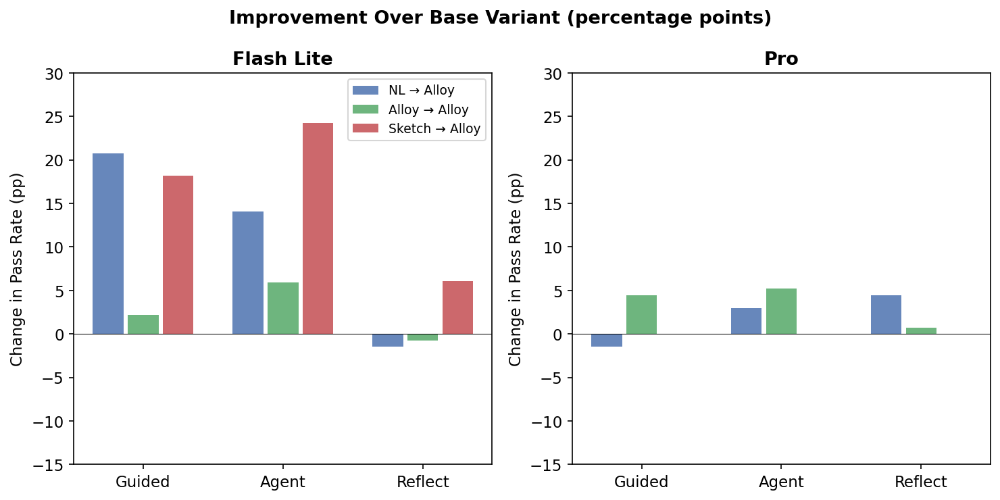
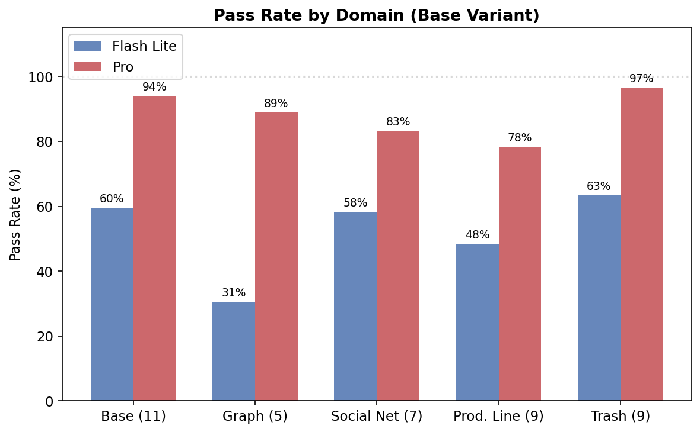
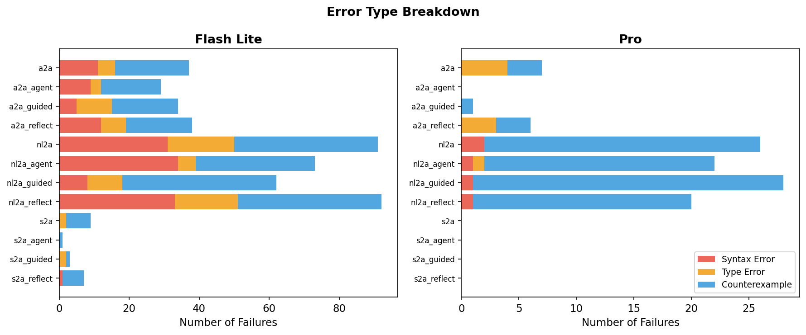
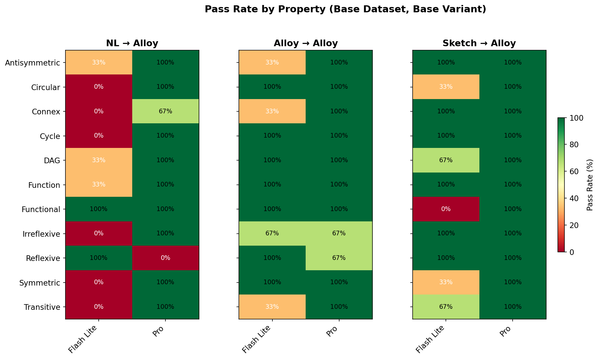

# Replication and Extension of "On the Effectiveness of LLMs in Writing Alloy Formulas"

**Shmulik Cohen**

*Mini Project --- Advanced Topics in Specification Engineering, Spring 2026*

---

## Abstract

We replicate and extend the study by Hong et al. (arXiv:2502.15441), which evaluated LLMs on three Alloy specification tasks.
The original study used OpenAI o3-mini and DeepSeek R1; we evaluate Google Gemini 2.5 Flash Lite and Gemini 2.5 Pro via Vertex AI.
We extend with three new task variants (guided, agent, reflect) and expand the benchmark from 11 to 41 properties across four additional domains.
Gemini 2.5 Pro achieves results comparable to the original study's reasoning models, with 100% on sketch completion and 95--100% on formula equivalence. The guided and agent variants improve the weaker Flash Lite model by up to 24 percentage points, while Pro is already near ceiling. Error analysis reveals a qualitative difference: Flash Lite fails on Alloy syntax, Pro fails on logic.

---

## 1. Introduction

Alloy is a lightweight formal specification language based on first-order relational logic. Writing correct Alloy formulas requires precise quantifiers, relational operators, and set-theoretic constructs --- making it a challenging target for LLM code generation.

Hong et al. conducted the first systematic evaluation of LLMs on Alloy formula synthesis. They tested two reasoning-oriented models (o3-mini, DeepSeek R1) on 11 properties using three tasks: natural language to Alloy, formula equivalence, and sketch completion. With 20 trials per property, DeepSeek R1 achieved 10+ correct formulas on 10/11 properties for the NL-to-Alloy task.

We replicate their protocol with Google Gemini models and extend it with additional task variants and a larger benchmark.

---

## 2. Background

### 2.1 Alloy

Alloy [2] models consist of *signatures* (types with fields) and *predicates* expressed in first-order relational logic. The Alloy Analyzer performs bounded model checking: given a scope, it exhaustively searches for counterexamples. UNSAT = valid; SAT = counterexample found.

Example --- reflexivity:
```alloy
sig S { r: set S }
pred Reflexive { all s: S | s->s in r }
```

### 2.2 Original Study

Hong et al. defined three tasks:

- **nl2alloy**: Generate Alloy formula from natural language description
- **alloy2alloy**: Generate logically equivalent Alloy formula from a canonical one
- **sketch2alloy**: Complete a partial formula with holes (`_`), with one error-feedback retry

Evaluated on 11 properties: 3 graph (DAG, Cycle, Circular) and 8 relation (Connex, Reflexive, Symmetric, Transitive, Antisymmetric, Irreflexive, Functional, Function).

---

## 3. Methodology

### 3.1 Models

Two Gemini models via Vertex AI:

- **Gemini 2.5 Flash Lite** --- lightweight, low-latency, cost-efficient
- **Gemini 2.5 Pro** --- high-capability with extended reasoning

This pairing contrasts a cheap/fast model with one closer in capability to o3-mini/R1.

### 3.2 Task Variants (12 total = 3 base tasks x 4 modes)

| Mode | Description |
|------|-------------|
| **Base** | Direct replication of the 3 original tasks |
| **Guided** | Same prompts + Alloy language reference injected into system prompt |
| **Agent** | Initial attempt + 1 round of Alloy compiler error feedback |
| **Reflect** | Initial attempt + 1 round of LLM self-critique (no compiler feedback) |

### 3.3 Dataset

**Base (11 properties):** Same as original study, with signatures, canonical formulas, sketches, and NL descriptions preserved.

**Extended (30 properties):** Four additional domains:
- Graph (5): undirected, oriented, strongly connected, transitive, weakly connected
- Social network (7): users, followers, photos, influencers
- Production line (9): workstations, human/robot workers, components
- Trash/filesystem (9): files, trash, protected files, links

Extended properties have no sketches, so sketch tasks run only on the 11 base properties.

### 3.4 Experimental Setup

- **3 trials** per property per task, temperature 1.0
- Alloy scope 3, 30-second timeout
- Agent/reflect capped at 2 LLM rounds
- **Structured JSON output** via Vertex AI to eliminate parsing artifacts
- 32 parallel threads, checkpointed every 10 trials
- Billed against Google Cloud credits

### 3.5 Validation

For each generated formula phi vs canonical formula phi*:
```alloy
check { pred_name iff (canonical_formula) } for 3
```
- UNSAT -> PASS
- SAT -> FAIL (Counterexample)
- Error -> FAIL (Syntax Error / Type Error)

### 3.6 Metrics

- **Pass rate**: fraction of trials that produce a correct formula
- **Error breakdown**: distribution of failure types (Syntax Error, Type Error, Counterexample)

---

## 4. Results

We ran 2,424 trials in total (2 models x 12 task variants x 41 properties x 3 solutions, minus sketch tasks on extended properties). Overall, 1,833 trials passed (75.6%).

### 4.1 Overall Performance

| Task | Variant | Flash Lite | Pro |
|------|---------|-----------|-----|
| nl2alloy | Base | 31.9% | 80.7% |
| | Guided | 52.6% | 79.3% |
| | Agent | 45.9% | 83.7% |
| | Reflect | 30.4% | 85.2% |
| alloy2alloy | Base | 72.6% | 94.8% |
| | Guided | 74.8% | 99.3% |
| | Agent | 78.5% | 100.0% |
| | Reflect | 71.9% | 95.6% |
| sketch2alloy | Base | 72.7% | 100.0% |
| | Guided | 90.9% | 100.0% |
| | Agent | 97.0% | 100.0% |
| | Reflect | 78.8% | 100.0% |

*Table 1: Pass rates across all task variants.*



Gemini 2.5 Pro achieves near-perfect results on alloy2alloy (94.8--100%) and sketch2alloy (100% across all variants), and strong results on nl2alloy (79.3--85.2%). Flash Lite shows a significant capability gap, particularly on nl2alloy (30.4--52.6%).

### 4.2 Effect of Task Variants

The benefit of task extensions depends heavily on model capability:



**Flash Lite** benefits substantially from guided prompting (+20.7pp on nl2alloy, +18.2pp on sketch2alloy) and the agent variant (+14.0pp on nl2alloy, +24.3pp on sketch2alloy). Reflect provides no improvement, and in some cases slightly hurts performance. This suggests that weaker models need either domain documentation or external tool feedback to overcome their limited Alloy knowledge --- self-critique alone is insufficient.

**Pro** is already near ceiling, so variants produce small effects (+3--5pp from agent). Notably, guided prompting slightly *decreases* nl2alloy performance for Pro (-1.4pp), possibly because the added context increases prompt length without providing information the model already has.

### 4.3 Base vs Extended Properties

| Domain | Flash Lite | Pro |
|--------|-----------|-----|
| Base (11 properties) | 60% | 94% |
| Graph (5) | 31% | 89% |
| Social Network (7) | 58% | 83% |
| Production Line (9) | 48% | 78% |
| Trash (9) | 63% | 97% |

*Table 2: Pass rates by domain, base variant only.*



Extended properties are generally harder than the base set. Flash Lite struggles most with the extended graph domain (31%), which includes complex properties like strong connectivity and transitivity of adjacency relations. Pro handles all domains well but shows its lowest performance on production line properties (78%), which involve the most complex signature structures (6 sigs with inheritance).

### 4.4 Error Analysis

The error profiles differ qualitatively between models:



- **Flash Lite**: 144 syntax errors, 81 type errors, 251 counterexamples. The high rate of syntax and type errors indicates the model frequently generates invalid Alloy syntax --- using wrong quantifier forms, incorrect operator precedence, or nonexistent constructs.
- **Pro**: 5 syntax errors, 8 type errors, 97 counterexamples. Nearly all failures are logically incorrect but syntactically valid formulas. Pro knows Alloy syntax well but occasionally gets the semantics wrong.

This distinction is visible in the per-property heatmap below: Flash Lite shows 0% on several properties (Antisymmetric, Transitive for nl2alloy) while Pro achieves 100% on most.



### 4.5 Comparison with Original Study

The original study used reasoning-oriented models (OpenAI o3-mini, DeepSeek R1) with 20 solutions per property. Our Gemini 2.5 Pro achieves comparable results: 100% on sketch2alloy (vs 10/11 in the paper), near-perfect alloy2alloy, and 81% on nl2alloy. The paper reported that DeepSeek R1 found at least one correct formula for all 11 properties on nl2alloy; Pro also achieves this on most properties.

Flash Lite, as a non-reasoning lightweight model, performs significantly below the paper's models, particularly on nl2alloy where generating formulas from scratch requires deeper understanding of Alloy semantics.

---

## 5. Discussion

### 5.1 Model Capability Gap

Our choice of Gemini 2.5 Flash Lite and Pro allows us to measure the capability spectrum: Flash Lite represents the class of fast, cheap models suitable for high-throughput experimentation, while Pro represents a stronger model with extended reasoning. Pro approaches the original study's results (95--100% on alloy2alloy, 100% on sketch2alloy), while Flash Lite reveals a lower bound on what lightweight models can achieve (55--67% overall). The most striking difference is in error profiles: Flash Lite's failures are dominated by syntax and type errors (47% of failures), whereas Pro almost exclusively produces logically incorrect but syntactically valid formulas. This suggests that Alloy syntax mastery is the primary bottleneck for weaker models.

### 5.2 Impact of Domain Knowledge (Guided Variant)

The guided variant injects an Alloy language reference covering operators, quantifiers, special relations, and common idioms into the system prompt. For Flash Lite, this produced the largest improvement on nl2alloy (+20.7pp) and sketch2alloy (+18.2pp). This suggests that weaker models struggle not with logical reasoning per se, but with Alloy's specific syntax and operator vocabulary --- a gap that in-context documentation can partially close. For Pro, the guided variant had negligible or slightly negative effect, indicating the model already has sufficient knowledge of Alloy built into its training.

### 5.3 Compiler Feedback vs Self-Critique

The agent variant (one round of Alloy compiler feedback) and the reflect variant (one round of self-critique) represent two approaches to iterative refinement. The agent variant was consistently the strongest performer: it achieved 100% on alloy2alloy for Pro and 97% on sketch2alloy for Flash Lite. Compiler feedback provides precise, actionable error information (e.g., "Syntax Error", "Type Error", or a concrete counterexample), whereas self-critique relies on the model's own understanding of Alloy, which may be incomplete. The gap between agent and reflect quantifies the value of tool integration in LLM-based formal methods workflows.

### 5.4 Structured Output as a Reliability Technique

A significant engineering finding was the impact of structured output on result reliability. Initially, we used free-form text generation with post-hoc parsing to extract formulas. This led to two classes of spurious failures: (1) the sketch2alloy task, where the model returned only the fill-in token (e.g., `implies`) instead of the complete formula, causing 60% of sketch failures; and (2) the alloy2alloy task, where the model returned formula fragments without quantifiers (e.g., `s in s.r` instead of `all s: S | s in s.r`), causing 36% of failures. Switching to Vertex AI's structured JSON output mode --- constraining the response to a `{"formula": "..."}` schema --- eliminated both failure classes entirely. This increased the overall pass rate from 28% to 59% on Flash Lite base tasks, with sketch2alloy improving from 24% to 91%. We also discovered and fixed a formula-cleaning bug where an aggressive `rstrip("}")` was stripping set literal braces (e.g., `{z}`) from valid Alloy expressions.

These findings suggest that for LLM-based formal methods, structured output constraints and careful prompt engineering are at least as important as model capability.

---

## 6. Threats to Validity

**Construct validity.** Equivalence checking at scope 3 may miss semantic differences that only manifest at larger scopes. This limitation is shared with the original study.

**Internal validity.** LLM outputs are non-deterministic. We run 3 trials per configuration (fewer than the paper's 20), which limits the statistical power of pass@k estimates. Structured JSON output eliminates formula extraction errors that affected early experiments. The agent and reflect variants are limited to a single retry round; increasing the feedback budget could yield higher pass rates.

**External validity.** We evaluate only Google Gemini models; a direct comparison with o3-mini and DeepSeek R1 on our extended tasks would strengthen the findings. The extended dataset, while broader, still consists of relatively simple Alloy specifications.

---

## 7. Related Work

**LLM code generation.** Chen et al. [3] introduced the HumanEval benchmark for evaluating LLM code generation. Our work applies a similar evaluation framework to a formal specification language rather than a general-purpose programming language.

**LLMs for formal methods.** Hong et al. [1], which we replicate, is the first study targeting Alloy specifically. Broader work on LLMs for formal specification and verification --- including proof generation for theorem provers and temporal logic synthesis from natural language --- has shown that models struggle with the precise logical reasoning these domains require.


**Tool-augmented generation.** Our agent variant, which feeds Alloy compiler errors back to the model, relates to compiler-in-the-loop approaches for code generation, where iterative refinement with tool feedback outperforms single-shot generation. The contrast between our agent and reflect variants provides a controlled comparison of external feedback vs self-critique.


---

## 8. Conclusion

We replicated and extended the study by Hong et al. on LLM-based Alloy formula synthesis. Using Google Gemini models (2.5 Flash Lite and 2.5 Pro), we evaluated 12 task variants across 41 properties spanning five domains. Our extensions --- guided prompting with domain documentation, compiler-in-the-loop feedback, and LLM self-critique --- provide new insights into how auxiliary techniques can improve formal specification generation. We also identified that structured output constraints and careful prompt engineering are critical for reliable evaluation, eliminating spurious failures that inflated error rates by over 35% in initial experiments. Our results and tooling are publicly available at [github.com/shmulc8/alloy-replication](https://github.com/shmulc8/alloy-replication).

Gemini 2.5 Pro matched or exceeded the original study's results on alloy2alloy and sketch2alloy, while Flash Lite demonstrated that guided prompting and compiler feedback can partially compensate for weaker model capabilities.

---

## References

1. Hong, F., Jiang, M., Fu, C., & Khurshid, S. (2025). On the Effectiveness of LLMs in Writing Alloy Formulas. *arXiv:2502.15441*.
2. Jackson, D. (2012). *Software Abstractions: Logic, Language, and Analysis.* MIT Press, revised edition.
3. Chen, M., Tworek, J., Jun, H., Yuan, Q., et al. (2021). Evaluating Large Language Models Trained on Code. *arXiv:2107.03374*.

